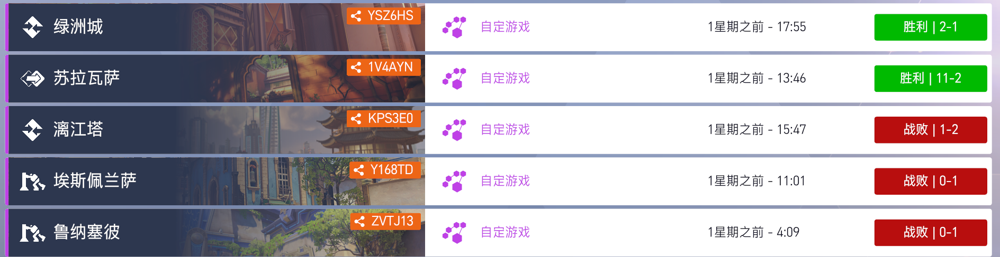
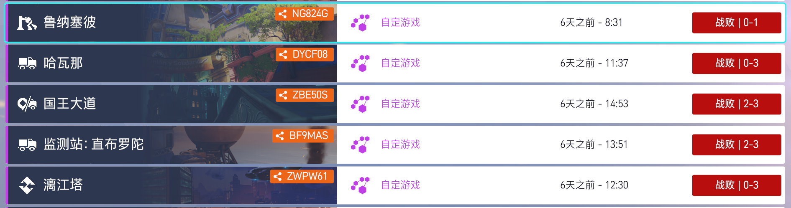
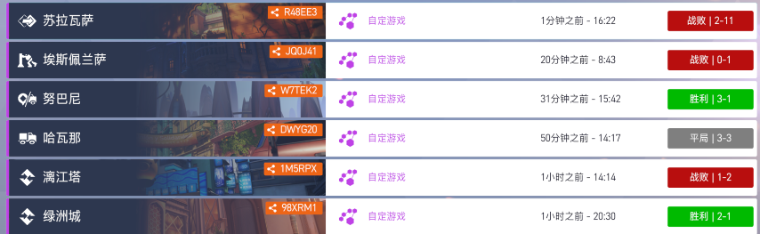
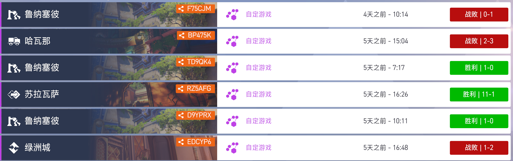
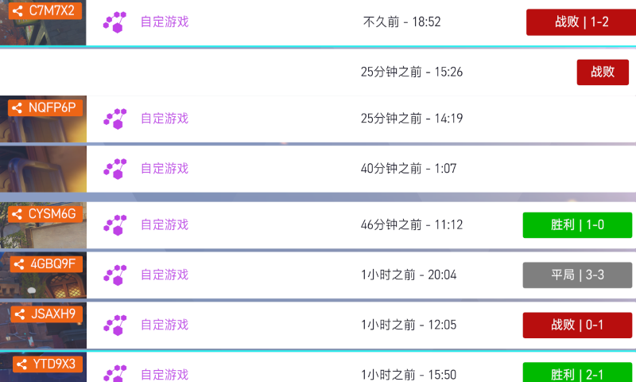
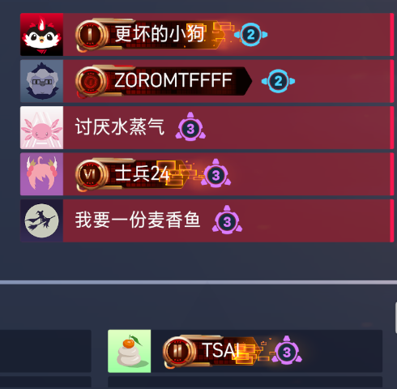

# 历史

## 2026-05-05 21:00-23:00 日服(GM2)  
  
  

绿洲城 YSZ6HS 胜利 **2-1**  
苏拉瓦萨 1V4AYN 胜利 **11-2**  
漓江塔 KPS3EO 战败 **1-2**  
埃斯佩兰萨 Y168TD 战败 **0-1**  
鲁纳塞彼 ZVTJ13 战败 **0-1**  

## 2026-05-06 21:00-23:00 韩服(M1)  
  
 

鲁纳塞彼 NG824G 战败 **0-1**  
哈瓦那 DYCF08 战败 **0-3**  
国王大道 ZBE50S 战败 **2-3**  
监测站: 直布罗陀 BF9MAS 战败 **2-3**  
漓江塔 ZWPW61 战败 **0-3**  

## 2026-05-15  战绩  
  
苏拉瓦萨 R48EE3 战败 **2-11**  
埃斯佩兰萨 JQ0J41 战败 **0-1**  
努巴尼 W7TEK2 胜利 **3-1**  
哈瓦那 DWYG20 平局 **3-3**  
漓江塔 1M5RPX 战败 **1-2**  
绿洲城 98XRM1 胜利 **2-1**  
## 2026-05-07 21:00-23:00 韩服(M2)  
  
 

鲁纳塞彼 F75CJM 战败 **0-1**  
哈瓦那 BP475K 战败 **2-3**  
鲁纳塞彼 TD9QK4 胜利 **1-0**  
苏拉瓦萨 RZ5AFG 胜利 **11-1**  
鲁纳塞彼 D9YPRX 胜利 **1-0**  
绿洲城 EDCYP6 战败 **1-2**  

## 2026-05-08 21:00-23:00 国服(GM5)
 
  

绿洲城 GYDWG8 战败 **1-2**  
苏拉瓦萨 3K7R03 战败 **2-3**  
埃斯佩兰萨 H9KT3Y 战败 **0-1**  
漓江塔 KCB0J7 胜利 **3-0**  
哈瓦那 ZZ6YVT 胜利 **3-2**  
哈瓦那(进攻) K7WPZK 平局 **2-0**

## 2026-05-13 21:00-24:00 国服(GM5)  
  
  

釜山 C7M7X2 战败 **1-2**  
阿特丽斯 NQFP6P 平局 **无比分**  
埃斯佩兰萨 CYSM6G 胜利 **1-0**  
暴雪世界 4GBQ9F 平局 **3-3**  
新皇后街 JSAXH9 战败 **0-1**  
漓江塔 YTD9X3 胜利 **2-1**
  
## 2026-05-15 21:00-24:00 韩服(GM5)  
 
  

苏拉瓦萨 R48EE3 战败 **2-11**  
埃斯佩兰萨 JQ0J41 战败 **0-1**  
努巴尼 W7TEK2 胜利 **3-1**  
哈瓦那 DWYG20 平局 **3-3**  
漓江塔 1M5RPX 战败 **1-2**  
绿洲城 98XRM1 胜利 **2-1**

